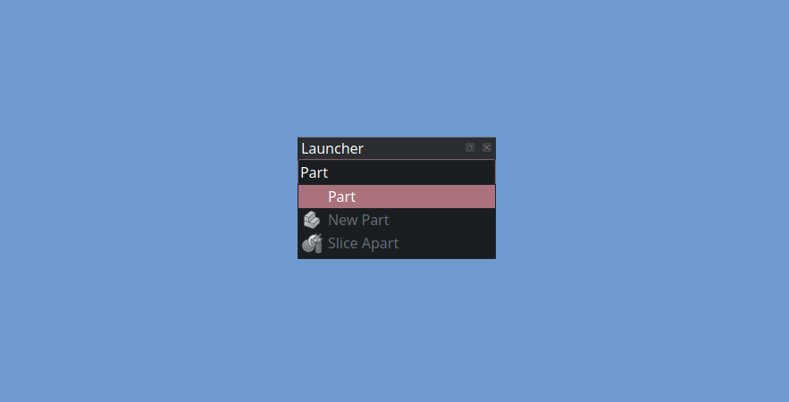

<!-- SPDX-License-Identifier: CC-BY-SA-4.0 -->
<!-- SPDX-FileNotice: Part of the Runner addon. -->

# Runner

Search for commands and run them.

 

## Usage

Focus the runner search box and start typing, focus the  
command you want to run and press enter or click it.

 

## Lifetime

This fork / addon will be maintained until  
the related [PR] has been merged into FreeCAD.

 

[PR]: https://github.com/FreeCAD/FreeCAD/pull/25833